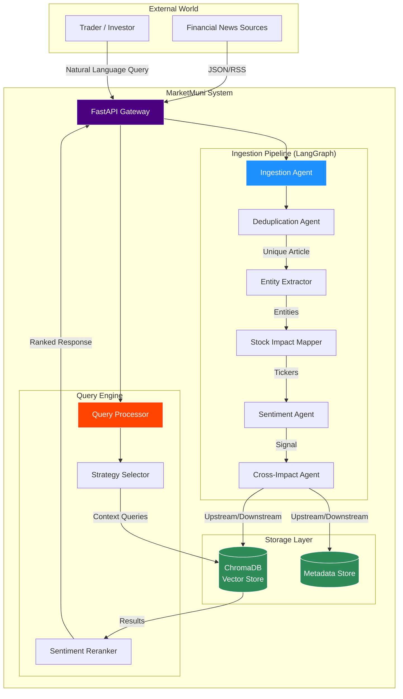

# MarketMuni - Financial News Intelligence System

A production-grade multi-agent AI system that processes financial news articles to extract entities, perform sentiment analysis, map stock impacts, and identify supply chain relationships using Large Language Models (LLMs) and semantic search.

## Overview

MarketMuni is an intelligent financial news processing pipeline that transforms unstructured news articles into structured, actionable market intelligence. The system combines LLM-based analysis with vector search and MongoDB storage to provide real-time insights into market sentiment, affected stocks, and cross-sectoral impacts.

### Key Capabilities

- **Entity Extraction**: Identifies companies, sectors, regulators, people, and market events with confidence scores
- **Stock Impact Mapping**: Maps news to affected stock symbols with reasoning and impact classification (direct, sector, regulatory)
- **Sentiment Analysis**: Determines market sentiment (Bullish/Bearish/Neutral) with signal strength and key factors
- **Supply Chain Analysis**: Infers upstream supplier impacts and downstream customer effects across sectors
- **Intelligent Query Processing**: Routes natural language queries to optimal search strategies with MongoDB filtering
- **Semantic Deduplication**: Prevents duplicate article processing using two-stage vector + cross-encoder approach

## 🏗️ System Architecture

### LangGraph Multi-Agent Pipeline




### System Design

MarketMuni employs a **LangGraph-based multi-agent architecture** where each agent specializes in a specific analysis task. The system uses a two-tier storage model:

- **MongoDB**: Stores full article content, metadata, and enriched analysis results
- **ChromaDB**: Maintains semantic embeddings for vector similarity search

```
┌─────────────────────────────────────────────────────────────┐
│                    NEWS INGESTION PIPELINE                   │
└─────────────────────────────────────────────────────────────┘
                            │
                            ▼
              ┌─────────────────────────┐
              │   Ingestion Agent       │
              │  - Validation           │
              │  - Embedding Generation │
              └─────────────┬───────────┘
                            │
                            ▼
              ┌─────────────────────────┐
              │  Deduplication Agent    │
              │  - Vector Search        │
              │  - MongoDB Hydration    │
              │  - Cross-Encoder Verify │
              └─────────────┬───────────┘
                            │
                            ▼
              ┌─────────────────────────┐
              │  Entity Extraction      │
              │  - LLM-based (Groq)     │
              │  - Companies + Tickers  │
              │  - Sectors & Regulators │
              │  - Redis Cache          │
              └─────────────┬───────────┘
                            │
                            ▼
              ┌─────────────────────────┐
              │  Stock Impact Mapper    │
              │  - LLM Reasoning        │
              │  - Impact Classification│
              │  - Confidence Scoring   │
              └─────────────┬───────────┘
                            │
                            ▼
              ┌─────────────────────────┐
              │  Sentiment Analyzer     │
              │  - LLM with Few-Shot    │
              │  - Entity Context       │
              │  - Signal Strength      │
              └─────────────┬───────────┘
                            │
                            ▼
              ┌─────────────────────────┐
              │  Supply Chain Analyzer  │
              │  - Upstream Impacts     │
              │  - Downstream Effects   │
              │  - Dependency Weights   │
              └─────────────┬───────────┘
                            │
                            ▼
              ┌─────────────────────────┐
              │   Indexing Agent        │
              │  - MongoDB Storage      │
              │  - Vector Indexing      │
              └─────────────────────────┘
```

### Query Processing Architecture

The system implements a **two-step adaptive query strategy** that optimizes between MongoDB filtering and vector search based on result set size:

```
┌──────────────────────────────────────────────────────────┐
│                  QUERY PROCESSING FLOW                    │
└──────────────────────────────────────────────────────────┘
                         │
                         ▼
           ┌─────────────────────────┐
           │    Query Router (LLM)   │
           │  - Intent Classification│
           │  - Entity Extraction    │
           │  - Strategy Selection   │
           └───────────┬─────────────┘
                       │
                       ▼
           ┌─────────────────────────┐
           │  MongoDB Filter Gen     │
           │  - Build Query Filter   │
           │  - Count Matches        │
           └───────────┬─────────────┘
                       │
           ┌───────────┴──────────┐
           │                      │
           ▼                      ▼
   Small Result Set      Large Result Set
  (≤1000 articles)      (>1000 articles)
           │                      │
           ▼                      ▼
   ┌──────────────┐      ┌──────────────┐
   │ Strategy A:  │      │ Strategy B:  │
   │ MongoDB →    │      │ Vector → DB  │
   │ Vector Search│      │ Validation   │
   └──────┬───────┘      └──────┬───────┘
          │                     │
          └──────────┬──────────┘
                     │
                     ▼
         ┌───────────────────────┐
         │  Reranking & Scoring  │
         │  - Semantic Similarity│
         │  - Strategy Match     │
         │  - Sentiment Boost    │
         └───────────┬───────────┘
                     │
                     ▼
              ┌─────────────┐
              │   Results   │
              └─────────────┘
```

### Technology Stack

**LLM & AI**
- **Groq API** (via LangChain): Powers all LLM-based agents using Llama 3.3 70B and Llama 3.1 8B models
- **SentenceTransformers**: Generates semantic embeddings (all-mpnet-base-v2)
- **Cross-Encoder**: High-precision similarity verification for deduplication
- **LangGraph**: Orchestrates multi-agent workflows with state management

**Storage & Caching**
- **MongoDB**: Primary storage for articles, metadata, and analysis results with indexed queries
- **ChromaDB**: Vector database for semantic similarity search
- **Redis**: LRU cache for entity extraction results (24-hour TTL)

**API & Framework**
- **FastAPI**: RESTful API with automatic OpenAPI documentation
- **Pydantic**: Structured schema validation for LLM outputs
- **Uvicorn**: ASGI server for production deployment

## Agents & Services

### Core Agents

1. **Ingestion Agent**: Validates article structure, generates embeddings, and prepares data for processing

2. **Deduplication Agent**: Implements two-stage semantic deduplication
   - Stage 1: Fast vector search in ChromaDB for candidate retrieval
   - Stage 2: Fetch full text from MongoDB
   - Stage 3: Cross-encoder verification for high precision

3. **Entity Extraction Agent**: LLM-powered extraction with Redis caching
   - Extracts companies with ticker symbols and sectors
   - Identifies regulators with jurisdictions
   - Detects market events and key people
   - Normalizes entities using fuzzy matching

4. **Stock Impact Mapper**: Maps news to affected stock symbols
   - Direct company mentions (high confidence)
   - Sector-wide implications (medium confidence)
   - Regulatory/policy impacts (lower confidence)
   - Provides detailed reasoning for each impact

5. **Sentiment Analyzer**: Determines market sentiment using few-shot prompting
   - Classifies as Bullish/Bearish/Neutral
   - Computes confidence score (0-100)
   - Calculates trading signal strength (0-100)
   - Extracts key factors supporting the sentiment

6. **Supply Chain Analyzer**: Infers cross-sectoral impacts
   - Identifies upstream supplier demand shocks
   - Analyzes downstream customer supply effects
   - Calculates dependency weights between sectors
   - Provides time horizons for impact realization

7. **Query Router**: LLM-based intelligent query understanding
   - Classifies query intent (7 strategies: DIRECT_ENTITY, SECTOR_WIDE, REGULATORY, etc.)
   - Extracts all mentioned entities and symbols
   - Generates MongoDB-compatible filter queries
   - Optimizes search strategy based on result set size

### Support Services

- **MongoDB Store**: Handles all database operations with connection pooling, health checks, and aggregation pipelines
- **Vector Store**: Manages ChromaDB operations for embedding storage and similarity search
- **Redis Cache Service**: Provides distributed caching with TTL and connection pooling
- **LLM Client**: Wraps Groq API with retry logic, exponential backoff, and structured output parsing

## Project Setup

### Prerequisites

- Python 3.12+
- MongoDB (local or Atlas)
- Redis (optional but recommended)
- Groq API Key

### Installation

1. **Clone the repository**
```bash
git clone <repository-url>
cd MarketMuni
```

2. **Install dependencies**
```bash
pip install -e .
```

3. **Environment Configuration**

Create a `.env` file in the project root:
```bash
# Required
GROQ_API_KEY=your_groq_api_key_here
MONGODB_URL=mongodb://localhost:27017/

# Optional (Redis)
REDIS_PASSWORD=your_redis_password
```

4. **Download spaCy Model**
```bash
python -m spacy download en_core_web_sm
```

5. **Configure Settings**

Edit `config.yaml` to customize:
- MongoDB connection settings
- Redis cache configuration
- Deduplication thresholds
- LLM model selection (fast vs reasoning models)
- Query processing parameters

### Running the Application

**Start the API Server**
```bash
python run.py
```

The API will be available at `http://localhost:8000`

**Access API Documentation**
- Swagger UI: `http://localhost:8000/docs`
- ReDoc: `http://localhost:8000/redoc`

### MongoDB Setup

The system automatically creates necessary indexes on startup:
- Unique index on `id`
- Indexes on `entities.Sectors`, `entities.Companies`, `impacted_stocks.symbol`
- Compound index on `entities.Sectors + sentiment.classification + timestamp`

### Redis Setup (Optional)

If Redis is unavailable, the system gracefully degrades to in-memory operation without caching.

## API Endpoints

### Ingestion

- `POST /ingest` - Process and analyze a financial news article

### Query & Search

- `GET /query` - Natural language search with automatic routing
  - Query parameters: `q` (query text), `top_k` (result limit), `filter_by_sentiment`
- `POST /query/explain` - Debug query routing and MongoDB filter generation

### Article Retrieval

- `GET /article/{article_id}` - Retrieve article with full analysis
- `GET /article/{article_id}/sentiment` - Get sentiment analysis details
- `GET /article/{article_id}/entities` - Get extracted entities with tickers
- `GET /article/{article_id}/stock_impacts` - Get stock impact mappings
- `GET /article/{article_id}/supply_chain` - Get supply chain impact analysis

### System

- `GET /health` - Health check for all components (MongoDB, Vector Store, Redis, LLM)
- `GET /stats` - System statistics and aggregations
- `GET /cache/stats` - Redis cache statistics
- `POST /cache/clear` - Clear cache entries

## Query Strategies

The system automatically selects the optimal strategy based on query analysis:

1. **DIRECT_ENTITY**: Specific company mentions → MongoDB filter by company/ticker
2. **SECTOR_WIDE**: Industry sector queries → MongoDB filter by sector
3. **REGULATORY**: Regulator/policy queries → MongoDB filter by regulator
4. **SENTIMENT_DRIVEN**: Sentiment-based queries → MongoDB filter by sentiment + sector
5. **CROSS_IMPACT**: Supply chain queries → MongoDB filter by multiple sectors
6. **TEMPORAL**: Time-based queries → Temporal sorting with entity filters
7. **SEMANTIC_SEARCH**: Broad queries → Pure vector similarity search

## Performance Optimizations

- **MongoDB Indexing**: Optimized indexes for common query patterns
- **Vector Search**: Efficient similarity search with configurable thresholds
- **Redis Caching**: Entity extraction results cached for 24 hours
- **Batch Operations**: Bulk insert/update support for MongoDB
- **Connection Pooling**: MongoDB and Redis connection pools with health checks
- **Adaptive Query Strategy**: Automatically switches between filter-first and search-first based on result set size

## Configuration

Key configuration files:

- `config.yaml`: Main system configuration (storage, LLM, agents)
- `prompts.yaml`: LLM prompts for all agents (entity extraction, sentiment, etc.)
- `.env`: Environment variables (API keys, connection strings)

## Monitoring & Debugging

The system provides comprehensive observability:

- Structured logging for all operations
- Health check endpoint for component status
- Statistics aggregation for sentiment distribution, supply chain impacts
- Query explanation endpoint for debugging routing decisions
- Cache statistics for performance monitoring

